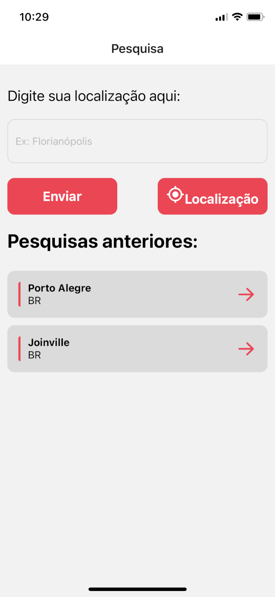
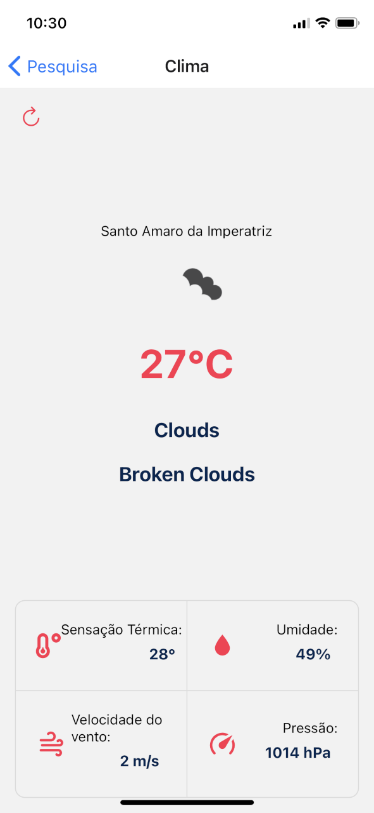
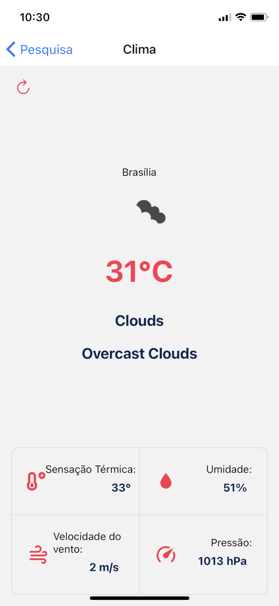

# APP Clima e Tempo consumindo API do Open Weather APP :)

React-Native APP

# Stack

- APP
  - React-Native
  - Expo CLI
  - React-Navigation
  - Fetch API
  - Redux

### Requirements

1. Para rodar o app em seu celular Android ou IOS, basta instalar o app Expo Go, gratis nas lojas de aplicativos.
2. Steps para rodar o projeto:
3. Clone o projeto em sua maquina: `git clone https://github.com/felipefln/OpenWeatherAPP.git`
4. Acesse a pasta do projeto, e dentro dela, rode um comando `yarn install` afim de instalar as dependências do projeto
5. Após instalar as depencias do APP, rode o comando para startar o servidor do app `yarn start`
6. Para renderizar o app, basta scannear o QR-Code gerado no momento de startar o servidor.

### Prints-Screen

## More info

By Felipe Weiduschadt de Carvalho
